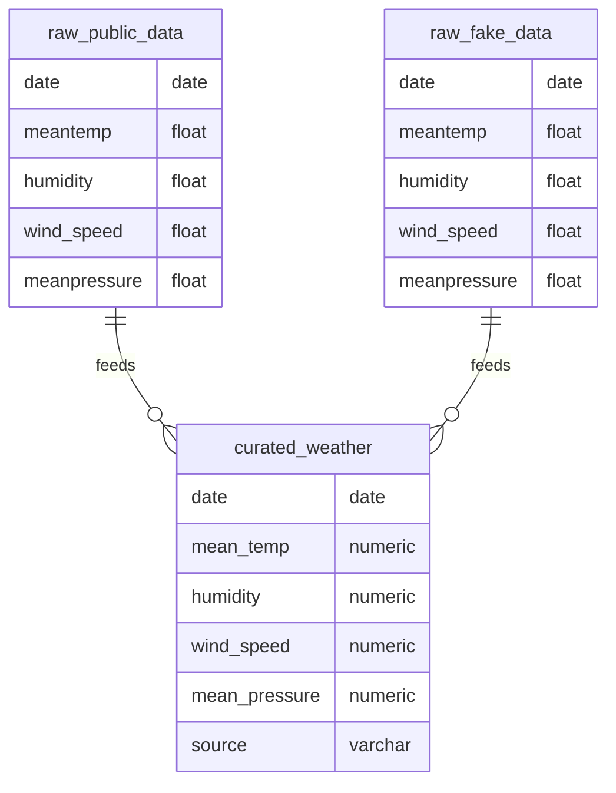

# Architecture and Design

## High-Level Architecture

The pipeline follows a **code repository** containing all components, with data flowing from two sources into a containerized processing layer that produces a curated dataset and supports reporting.

```
┌─────────────────────────────────────────────────────────────────────────────┐
│                           CODE REPOSITORY                                    │
├─────────────────┬─────────────────┐                                        │
│ Public Dataset  │ FastAPI Fake    │                                        │
│ (CSV)           │ Dataset (API)   │  ──ingests──►  ┌─────────────────────┐ │
└─────────────────┴─────────────────┘               │     CONTAINER        │ │
                                                    │  ┌─────┬─────┐        │ │
                                                    │  │ DB  │ dbt │        │ │
                                                    │  ├─────┼─────┤        │ │
                                                    │  │ Orch│ Py  │        │ │
                                                    │  │     │Ingest        │ │
                                                    │  └─────┴─────┘        │ │
                                                    └──────────┬────────────┘ │
                                                               │ -creates     │
                                                               ▼              │
                                                    ┌─────────────────────┐   │
                                                    │ Curated & Cleaned   │   │
                                                    │ Dataset             │   │
                                                    └──────────┬──────────┘   │
                                                               │              │
                                                               ▼              │
                                                    ┌─────────────────────┐   │
                                                    │ Reporting           │   │
                                                    └─────────────────────┘   │
└─────────────────────────────────────────────────────────────────────────────┘
```

## Components

| Component | Technology | Responsibility |
|-----------|------------|----------------|
| **Database** | PostgreSQL 15 | Stores raw tables (`raw_public_data`, `raw_fake_data`) and dbt-built views (`stg_*`, `curated_weather`) |
| **API** | FastAPI | Serves synthetic weather data at `/fake_weather?days=N` |
| **Python ingestion** | pandas, SQLAlchemy, requests | Loads CSV and API response into raw tables |
| **Orchestrator** | Python script in `pipeline/orchestrator.py` | Waits for DB/API, drops prior dbt views, runs ingestion, runs `dbt run`, verifies |
| **dbt** | dbt-core + dbt-postgres | Staging views (rounding, `source` column) and curated view (union of public + fake) |
| **Reporting** | Plotly, pandas | Reads `curated_weather` and produces a line chart |

## Data Flow

1. **Ingestion**: Public CSV → `raw_public_data`; FastAPI → `raw_fake_data`.
2. **Transformation**: dbt builds `stg_public_data`, `stg_fake_data`, then `curated_weather` (view) in schema `public_public`.
3. **Output**: `curated_weather` is the single curated dataset used for reporting.

## Database Schema (for ER diagram)

- **raw_public_data** (table): date, meantemp, humidity, wind_speed, meanpressure (from CSV).
- **raw_fake_data** (table): same columns (from API).
- **public_public.stg_public_data** (view): date, mean_temp, humidity, wind_speed, mean_pressure, source='public'.
- **public_public.stg_fake_data** (view): same structure, source='fake'.
- **public_public.curated_weather** (view): union of the two staging views; final dataset.

An ER diagram is provided as `docs/er_diagram.png`. Below is the same schema in Mermaid (you can export to PNG via [Mermaid Live](https://mermaid.live) or `mmdc`):


